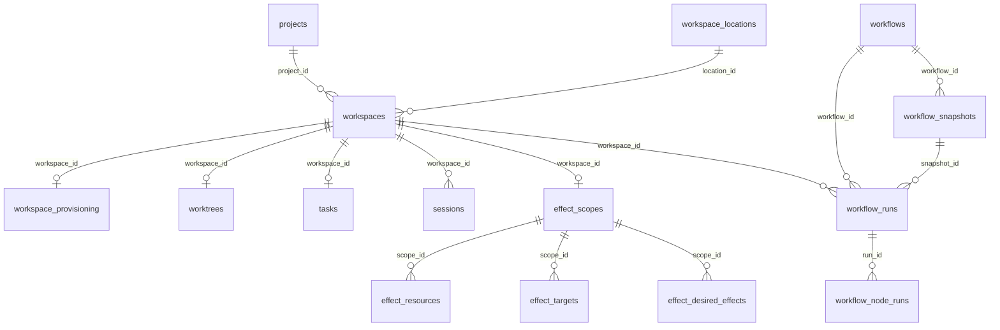

# 数据库设计

> 核对日期：2026-09-10。依据本地 `project_learn` 分支 `0001`～`0010` 迁移的**最终结构**，共 49 张表：18 张业务／配置表、30 张 Effect 表、1 张迁移记录表。字段清单通过只在内存 SQLite 中执行迁移 SQL 后提取，不读取或修改用户数据库。

[返回学习导航](../README.md)

## 模块职责

解释哪些业务事实必须落表、表如何关联，以及表不能覆盖哪些文件和运行时状态。逐模块流程参见各模块，本文集中列出全表、全部字段和真实数据库约束。

## 设计逻辑与执行流程

Backend 打开 `<app_data_directory>/ora.sqlite3`，DatabaseBootstrapper 按目标版本序列协调结构，再由 RepositoryPool 向各 repository 提供连接。应用层依赖 Trait，不写 SQLite 细节。

连接统一设置 WAL、5 秒 busy timeout、`synchronous=NORMAL`、`foreign_keys=ON`；内存测试池只有一个连接，避免多个匿名内存库各有各的 schema。文件数据库使用连接池，但 SQLite 写事务仍有竞争，WAL 不等于无限并发写。

迁移记录存 `version/up_sql/down_sql/executed_at`。普通启动走版本协调；显式工具 `reconcile_migration_history` 才处理同版本 SQL 漂移的回滚重建。目标版本缩短也可能执行 down，不能把任意分支切换理解成永远只升级。

### 迁移路线

| 版本 | 引入／变化 |
| --- | --- |
| 0001 | 用户配置、项目、位置、工作区、准备状态、worktree、任务、Session |
| 0002 | Skill 目录与配置角色 |
| 0003 | Workflow 定义、快照、Run、NodeRun |
| 0004 | Git 清理 job、worktree 创建 lease |
| 0005 | 市场来源 |
| 0006 | 30 张 Effect 表及一致性约束 |
| 0007 | 独立持久来源 namespace |
| 0008 | 市场来源 enabled |
| 0009 | 市场 artifact_retrieval JSON |
| 0010 | Effect operation detected_at；删除自动创建 Scope 的旧触发器 |

### 主要关系

图中只画部分物理外键。以下是**业务关联，数据库没有对应外键**：

- `workflows.published_snapshot_id → workflow_snapshots.id`。
- `workflow_node_runs.session_id → sessions.id`。
- `sessions.agent_cli` 对应安装 Agent 包的完整身份，不指向 `agents` 角色表。
- Git 清理 job／provisioning lease 的项目与工作区 ID 是清理证据，无物理外键。
- Effect 某些投影引用是冻结的历史身份，不能看见 `_id` 就假设数据库声明了外键；逐表外键清单才是准确信息。

## 数据库表与持久化

### 先判断应该存在哪里

| 业务事实 | 权威存储 | 必须注意 |
| --- | --- | --- |
| 项目、工作区、任务身份与位置 | 对应 SQLite 表 | Task 不是 Runtime 所有权根 |
| 会话当前绑定与可写状态 | sessions | status 不等于正在生成 |
| 对话正文、切换／交接事件 | sessions 目录 JSONL | 不存在 messages 表 |
| 工作流版本与执行结果 | 四张 workflow 表 | NodeRun output 不重复存完整聊天 |
| 本地 Skill 正文 | atoms/skills 包文件 | skills 表只存目录信息 |
| 配置角色正文 | agents.content | 不启动 CLI |
| Skill 期望、资源账本、恢复证据 | effect_* 与资源文件 | 外部修改前登记意图 |
| 插件包与值 | 安装目录、store.json | 无 installed_plugins／plugin_settings 表 |
| MCP 服务值与快照 | store.json＋内存／ACP | 禁止复制进 SQLite 或 Effect |
| 草稿、UI、模型偏好 | localStorage 或内存 | 不等于后端业务提交 |
| 代码、Git 对象、工作树、diff | 文件系统／Git | 不复制成文件树表 |
| 日志／下载／更新包 | 各自文件目录 | 无普通日志或更新表 |

### 状态、时间和事务约定

- Session：`0=Running`，`1=Stopped`；history_degraded_reason 非 NULL 表示历史写入降级，两者独立。
- Workflow Run 与 NodeRun：`0=Pending, 1=Running, 2=Succeeded, 3=Failed, 4=Cancelled`。同一个数字在 sessions 中意义不同。
- 大部分 `*_at` 是 epoch 毫秒，展示用本地时区；JSONL 时间是带偏移的 RFC 3339，不要把 INTEGER 时间误当成秒。
- `is_deleted` 是业务软删除，不触发 SQL ON DELETE CASCADE。父对象删除必须走 aggregate repository，同时检查运行中的后代。
- JSON 的 `*_version`／`*_kind` 是合同版本与类型；数据库列存在不代表任意 JSON 都被业务接受。
- 跨 SQLite／Git／文件的操作依赖 journal、补偿和恢复，没有一个能包住全部资源的 SQLite 事务。

### 关键字段如何理解

| 字段／字段族 | 含义与使用边界 |
| --- | --- |
| `id` 与各种 `*_id` | 保存稳定身份；名称可变，不用显示名称替代关联。是否有物理外键须查逐表清单 |
| `namespace,name`／`identifier` | 区分不同来源的同名资源；来源 namespace 一旦进入包身份就不能随意重分配 |
| `locator_version,locator_json` | 位置合同及版本，不能默认所有 locator 都是一个本地路径字符串 |
| `requested_*` 与 `actual_*` | 分别记录准备意图和实际结果，失败排查时不能只保留用户期望 |
| `graph` | 完整工作流图 JSON；节点配置和边藏在这里，不是额外关系表 |
| `input,output,error,payload,state` | 工作流执行输入、结果、错误及业务状态／扩展合同；以业务 mapper 和执行引擎解释，不按同名字段猜内部结构 |
| `revision_id`／`revision_key` | 指向交付内容版本；已发布的不可变定义不通过原位覆盖更改 |
| `generation` 与进度 generation | Effect 的期望／观察／应用／就绪代次；不是插件 PID 或 ACP 连接代次 |
| `digest,fingerprint,input_digest` | 固定声明／输入／已应用内容的比较证据；不是通用意义上的可信数字签名 |
| `claim_token,claim_fence,resource_fence` | 领取权利及过期执行者隔离证据；必须结合 lease 和事务校验使用 |
| `lease_until,lease_expires_at,not_before` | 租约到期或最早重试时间；进程内定时器消失后仍可据此恢复调度 |
| `expected_json,planned_json,payload_json` | 外部修改前的预期、计划和适配器执行合同；必须在修改前保留，供恢复使用 |
| `proof_json` 与 `*_receipts` | 协调／readiness 确认的证据，不能由“文件已经存在”直接推导 |
| `detected_at` | Operation 进入 recovery_required 的发现时间；与正常审计更新时间分离 |

### 全表责任索引

| 表 | 所属模块 | 保存的事实与写入时机 |
| --- | --- | --- |
| `migrations` | [数据库设计](../数据库设计/模块说明.md) | 已执行迁移版本及 up/down SQL 快照；结构变更事务成功时登记。 |
| `user_config` | [配置管理](../配置管理/模块说明.md) | 后端偏好键值；Settings 按 key 保存／删除。 |
| `projects` | [项目与工作区](../项目与工作区/模块说明.md) | 项目身份及仓库属性；项目 CRUD 与级联软删除。 |
| `workspace_locations` | [项目与工作区](../项目与工作区/模块说明.md) | 版本化实际位置合同；创建／定位工作区时持久化。 |
| `workspaces` | [项目与工作区](../项目与工作区/模块说明.md) | 执行归属、类型与 lifecycle；工作区创建／推进／软删除。 |
| `workspace_provisioning` | [项目与工作区](../项目与工作区/模块说明.md) | 请求和实际准备结果；工作区准备意图与完成／失败时更新。 |
| `worktrees` | [任务与工作树](../任务与工作树/模块说明.md) | Git 分支与不可变 base commit；创建及级联软删除。 |
| `tasks` | [任务与工作树](../任务与工作树/模块说明.md) | 隔离 Workspace 的用户可见标题；创建／重命名／软删除。 |
| `sessions` | [会话生命周期](../会话生命周期/模块说明.md) | Ora 会话、当前 provider 绑定及历史可写状态；runtime 创建、换绑、状态推进、重命名、软删除。 |
| `skills` | [技能与角色定义](../技能与角色定义/模块说明.md) | 技能目录元数据；本地 CRUD 与插件技能投影，正文在包文件。 |
| `agents` | [技能与角色定义](../技能与角色定义/模块说明.md) | 配置角色定义，content 为角色内容；角色 CRUD，不保存运行进程。 |
| `workflows` | [工作流定义与版本](../工作流定义与版本/模块说明.md) | 定义身份与发布指针；定义 CRUD／发布／激活。 |
| `workflow_snapshots` | [工作流定义与版本](../工作流定义与版本/模块说明.md) | draft／发布版本的完整 graph JSON；编辑 draft、复制发布快照、软删除。 |
| `workflow_runs` | [工作流执行与恢复](../工作流执行与恢复/模块说明.md) | 一次工作区执行的快照、输入输出和运行状态；创建、调度、取消、完成、恢复。 |
| `workflow_node_runs` | [工作流执行与恢复](../工作流执行与恢复/模块说明.md) | 一次节点执行尝试及可选 Session 绑定；调度接纳、等待输入、结果／终态推进。 |
| `git_cleanup_jobs` | [任务与工作树](../任务与工作树/模块说明.md) | 删除后仍需处理的 Git 资源证据；删除事务创建，worker 更新尝试和结果。 |
| `worktree_provisioning_leases` | [任务与工作树](../任务与工作树/模块说明.md) | 创建在途资源的过期租约；worktree 准备过程中登记／释放，支持恢复判断。 |
| `plugin_marketplace_source` | [插件安装与生命周期](../插件安装与生命周期/模块说明.md) | 可编辑的市场 URL／分支／顺序／开关／下载方式；来源配置增改删。 |
| `plugin_source_namespace` | [插件安装与生命周期](../插件安装与生命周期/模块说明.md) | canonical URL 到不可变 namespace 的绑定；首次分配，来源删除后保留。 |
| `effect_scopes` | [技能交付与效果协调](../技能交付与效果协调/模块说明.md) | 工作区 Scope 与期望 generation；项目／任务创建显式插入，Desired／源变化推进。 |
| `effect_sources` | [技能交付与效果协调](../技能交付与效果协调/模块说明.md) | 交付源稳定身份及发布指针；发现、发布、退役时写。 |
| `effect_revisions` | [技能交付与效果协调](../技能交付与效果协调/模块说明.md) | 不可变交付定义、digest 与可用性；发布新版本插入，可用性可更新。 |
| `effect_desired_effects` | [技能交付与效果协调](../技能交付与效果协调/模块说明.md) | 作用域期望选择、参数和 selector；CAS 替换选择时写。 |
| `effect_consumers` | [技能交付与效果协调](../技能交付与效果协调/模块说明.md) | 消费者稳定身份、适配器、当前能力版本；消费者声明／退役时写。 |
| `effect_consumer_revisions` | [技能交付与效果协调](../技能交付与效果协调/模块说明.md) | 不可变能力声明；能力变化插入新版本。 |
| `effect_targets` | [技能交付与效果协调](../技能交付与效果协调/模块说明.md) | Scope 下的消费者实例与 fence；声明目标、退役、claim 时更新。 |
| `effect_target_declarations` | [技能交付与效果协调](../技能交付与效果协调/模块说明.md) | 目标当前声明快照及 digest；声明协调时写。 |
| `effect_resources` | [技能交付与效果协调](../技能交付与效果协调/模块说明.md) | 实际共享资源描述与 fence；资源解析、退役、claim 时更新。 |
| `effect_target_resource_bindings` | [技能交付与效果协调](../技能交付与效果协调/模块说明.md) | Target 与 Resource 的同 Scope 关联、接受合同与协调要求；声明协调时写。 |
| `effect_target_projections` | [技能交付与效果协调](../技能交付与效果协调/模块说明.md) | 某 generation 的不可变目标投影；计划阶段插入。 |
| `effect_target_projection_effects` | [技能交付与效果协调](../技能交付与效果协调/模块说明.md) | 目标投影选中的 Desired ID 明细；与投影一起冻结。 |
| `effect_resource_requirements` | [技能交付与效果协调](../技能交付与效果协调/模块说明.md) | 目标投影对某资源提出的物化合同；计划阶段冻结。 |
| `effect_resource_requirement_effects` | [技能交付与效果协调](../技能交付与效果协调/模块说明.md) | 一条资源需求所涉及的 Desired ID；需求冻结时写。 |
| `effect_resource_projections` | [技能交付与效果协调](../技能交付与效果协调/模块说明.md) | 某资源的合并投影；资源计划冻结时插入。 |
| `effect_resource_projection_contributors` | [技能交付与效果协调](../技能交付与效果协调/模块说明.md) | 资源投影中每个目标贡献的需求；合并计划时写。 |
| `effect_resolved_materializations` | [技能交付与效果协调](../技能交付与效果协调/模块说明.md) | 解析完成的资源输入、native identity、revision 和合同；外部修改前冻结。 |
| `effect_managed_items` | [技能交付与效果协调](../技能交付与效果协调/模块说明.md) | 已成功应用的受管对象账本、fingerprint 和 generation；操作 finalize 时与 journal 一起更新。 |
| `effect_target_status` | [技能交付与效果协调](../技能交付与效果协调/模块说明.md) | 目标 desired／observed／applied／ready 进度和恢复状态；协调阶段推进。 |
| `effect_resource_status` | [技能交付与效果协调](../技能交付与效果协调/模块说明.md) | 资源 desired／observed／applied 进度和恢复状态；资源阶段推进。 |
| `effect_conditions` | [技能交付与效果协调](../技能交付与效果协调/模块说明.md) | 可解释的阻塞／非阻塞问题和重试规则；观察问题时 upsert／清除。 |
| `effect_reconcile_requests` | [技能交付与效果协调](../技能交付与效果协调/模块说明.md) | 持久化目标唤醒、claim、退避与阻塞状态；入队、worker 领取／完成／重试时写。 |
| `effect_resource_claims` | [技能交付与效果协调](../技能交付与效果协调/模块说明.md) | 资源独占租约、目标 token 和 resource fence；worker 领取／续约／释放。 |
| `effect_reconcile_attempts` | [技能交付与效果协调](../技能交付与效果协调/模块说明.md) | 一次目标协调的冻结计划及阶段；执行前准备、执行中推进。 |
| `effect_attempt_resource_projections` | [技能交付与效果协调](../技能交付与效果协调/模块说明.md) | 尝试使用的资源投影及序号；创建 attempt 时冻结。 |
| `effect_coordination_receipts` | [技能交付与效果协调](../技能交付与效果协调/模块说明.md) | safe_to_mutate／reactivated 的消费者证据；收到协调确认时追加。 |
| `effect_operations` | [技能交付与效果协调](../技能交付与效果协调/模块说明.md) | 具体外部修改的 expected／planned／payload 意图、阶段及恢复发现时间；修改前准备，应用／finalize／发现异常时推进。 |
| `effect_operation_artifacts` | [技能交付与效果协调](../技能交付与效果协调/模块说明.md) | 操作附属的备份／暂存定位证据、指纹与状态；准备恢复材料及清理时写。 |
| `effect_readiness_receipts` | [技能交付与效果协调](../技能交付与效果协调/模块说明.md) | 目标某 generation 已 ready 的证明；verify ready 成功时插入。 |
| `effect_audit_events` | [技能交付与效果协调](../技能交付与效果协调/模块说明.md) | 不可变业务审计事件、发起者及安全 payload；对应 Effect 变化时追加。 |

### 完整字段与约束

以下每个表列出全部字段、显式 NOT NULL、默认值、主键位置和实际外键。`PK1/PK2` 表示复合主键中的序号；NOT NULL 列严格反映 DDL 声明，不能把 SQLite 普通 TEXT PRIMARY KEY 自动理解为显式 NOT NULL。业务正常写入仍使用非空合法身份。

每表“其他索引与约束”列出原始索引／触发器 SQL 的名称和可读定义；CHECK 约束及 trigger 的完整实现请看该表链接的迁移，0010 的变化另外列出。JSON 内容由对应业务合同解释。

#### migrations

已执行迁移版本及 up/down SQL 快照；结构变更事务成功时登记。

定义来源：[runner.rs](../../crates/db/src/migration/runner.rs)。

| 字段 | SQLite 类型 | 显式 NOT NULL | 默认值 | 主键位置 |
| --- | --- | --- | --- | --- |
| `version` | TEXT | 否 | 无 | PK1 |
| `up_sql` | TEXT | 是 | 无 | — |
| `down_sql` | TEXT | 是 | 无 | — |
| `executed_at` | INTEGER | 是 | 无 | — |

物理外键：无。

#### user_config

后端偏好键值；Settings 按 key 保存／删除。

定义来源：[schema_v0001.rs](../../crates/db/src/migration/schema/schema_v0001.rs)。

| 字段 | SQLite 类型 | 显式 NOT NULL | 默认值 | 主键位置 |
| --- | --- | --- | --- | --- |
| `key` | TEXT | 否 | 无 | PK1 |
| `value` | TEXT | 是 | 无 | — |

物理外键：无。

#### projects

项目身份及仓库属性；项目 CRUD 与级联软删除。

定义来源：[schema_v0001.rs](../../crates/db/src/migration/schema/schema_v0001.rs)。

| 字段 | SQLite 类型 | 显式 NOT NULL | 默认值 | 主键位置 |
| --- | --- | --- | --- | --- |
| `id` | TEXT | 否 | 无 | PK1 |
| `name` | TEXT | 是 | 无 | — |
| `repository_kind` | TEXT | 是 | `'git'` | — |
| `repository_url` | TEXT | 否 | 无 | — |
| `default_branch` | TEXT | 否 | 无 | — |
| `created_at` | INTEGER | 是 | 无 | — |
| `updated_at` | INTEGER | 是 | 无 | — |
| `is_deleted` | INTEGER | 是 | `0` | — |

物理外键：无。

#### workspace_locations

版本化实际位置合同；创建／定位工作区时持久化。

定义来源：[schema_v0001.rs](../../crates/db/src/migration/schema/schema_v0001.rs)。

| 字段 | SQLite 类型 | 显式 NOT NULL | 默认值 | 主键位置 |
| --- | --- | --- | --- | --- |
| `id` | TEXT | 否 | 无 | PK1 |
| `location_kind` | TEXT | 是 | 无 | — |
| `plugin_id` | TEXT | 否 | 无 | — |
| `locator_version` | INTEGER | 是 | `1` | — |
| `locator_json` | TEXT | 是 | 无 | — |
| `created_at` | INTEGER | 是 | 无 | — |
| `updated_at` | INTEGER | 是 | 无 | — |

物理外键：无。

#### workspaces

执行归属、类型与 lifecycle；工作区创建／推进／软删除。

定义来源：[schema_v0001.rs](../../crates/db/src/migration/schema/schema_v0001.rs)。

| 字段 | SQLite 类型 | 显式 NOT NULL | 默认值 | 主键位置 |
| --- | --- | --- | --- | --- |
| `id` | TEXT | 否 | 无 | PK1 |
| `project_id` | TEXT | 是 | 无 | — |
| `workspace_kind` | TEXT | 是 | 无 | — |
| `location_id` | TEXT | 是 | 无 | — |
| `lifecycle` | TEXT | 是 | `'provisioning'` | — |
| `created_at` | INTEGER | 是 | 无 | — |
| `updated_at` | INTEGER | 是 | 无 | — |
| `is_deleted` | INTEGER | 是 | `0` | — |

物理外键：

- `(location_id) → workspace_locations(id)`；ON DELETE NO ACTION。
- `(project_id) → projects(id)`；ON DELETE NO ACTION。

其他索引：

- `CREATE INDEX idx_workspaces_project ON workspaces(project_id, created_at, id)`。
- `CREATE UNIQUE INDEX workspaces_active_project_main_unique ON workspaces(project_id) WHERE workspace_kind = 'main' AND is_deleted = 0`。

#### workspace_provisioning

请求和实际准备结果；工作区准备意图与完成／失败时更新。

定义来源：[schema_v0001.rs](../../crates/db/src/migration/schema/schema_v0001.rs)。

| 字段 | SQLite 类型 | 显式 NOT NULL | 默认值 | 主键位置 |
| --- | --- | --- | --- | --- |
| `workspace_id` | TEXT | 否 | 无 | PK1 |
| `provisioner_kind` | TEXT | 是 | 无 | — |
| `plugin_id` | TEXT | 否 | 无 | — |
| `requested_revision` | TEXT | 否 | 无 | — |
| `requested_branch` | TEXT | 否 | 无 | — |
| `actual_revision` | TEXT | 否 | 无 | — |
| `actual_branch` | TEXT | 否 | 无 | — |
| `requested_locator_json` | TEXT | 否 | 无 | — |
| `actual_locator_json` | TEXT | 否 | 无 | — |
| `state` | TEXT | 是 | 无 | — |
| `last_error_code` | TEXT | 否 | 无 | — |
| `created_at` | INTEGER | 是 | 无 | — |
| `updated_at` | INTEGER | 是 | 无 | — |

物理外键：

- `(workspace_id) → workspaces(id)`；ON DELETE NO ACTION。

#### worktrees

Git 分支与不可变 base commit；创建及级联软删除。

定义来源：[schema_v0001.rs](../../crates/db/src/migration/schema/schema_v0001.rs)。

| 字段 | SQLite 类型 | 显式 NOT NULL | 默认值 | 主键位置 |
| --- | --- | --- | --- | --- |
| `workspace_id` | TEXT | 否 | 无 | PK1 |
| `branch_name` | TEXT | 否 | 无 | — |
| `base_commit_id` | TEXT | 否 | 无 | — |
| `created_at` | INTEGER | 是 | 无 | — |
| `updated_at` | INTEGER | 是 | 无 | — |
| `is_deleted` | INTEGER | 是 | `0` | — |

物理外键：

- `(workspace_id) → workspaces(id)`；ON DELETE NO ACTION。

#### tasks

隔离 Workspace 的用户可见标题；创建／重命名／软删除。

定义来源：[schema_v0001.rs](../../crates/db/src/migration/schema/schema_v0001.rs)。

| 字段 | SQLite 类型 | 显式 NOT NULL | 默认值 | 主键位置 |
| --- | --- | --- | --- | --- |
| `id` | TEXT | 否 | 无 | PK1 |
| `workspace_id` | TEXT | 是 | 无 | — |
| `title` | TEXT | 是 | 无 | — |
| `created_at` | INTEGER | 是 | 无 | — |
| `updated_at` | INTEGER | 是 | 无 | — |
| `is_deleted` | INTEGER | 是 | `0` | — |

物理外键：

- `(workspace_id) → workspaces(id)`；ON DELETE NO ACTION。

表级 UNIQUE：`(workspace_id)`。

#### sessions

Ora 会话、当前 provider 绑定及历史可写状态；runtime 创建、换绑、状态推进、重命名、软删除。

定义来源：[schema_v0001.rs](../../crates/db/src/migration/schema/schema_v0001.rs)。

| 字段 | SQLite 类型 | 显式 NOT NULL | 默认值 | 主键位置 |
| --- | --- | --- | --- | --- |
| `id` | TEXT | 否 | 无 | PK1 |
| `workspace_id` | TEXT | 是 | 无 | — |
| `title` | TEXT | 否 | 无 | — |
| `agent_cli` | TEXT | 是 | 无 | — |
| `agent_session_id` | TEXT | 是 | 无 | — |
| `history_degraded_reason` | TEXT | 否 | 无 | — |
| `status` | INTEGER | 是 | `0` | — |
| `created_at` | INTEGER | 是 | 无 | — |
| `updated_at` | INTEGER | 是 | 无 | — |
| `is_deleted` | INTEGER | 是 | `0` | — |

物理外键：

- `(workspace_id) → workspaces(id)`；ON DELETE NO ACTION。

其他索引：

- `CREATE INDEX idx_sessions_workspace ON sessions(workspace_id, created_at, id)`。

#### skills

技能目录元数据；本地 CRUD 与插件技能投影，正文在包文件。

定义来源：[schema_v0002.rs](../../crates/db/src/migration/schema/schema_v0002.rs)。

| 字段 | SQLite 类型 | 显式 NOT NULL | 默认值 | 主键位置 |
| --- | --- | --- | --- | --- |
| `id` | TEXT | 否 | 无 | PK1 |
| `namespace` | TEXT | 是 | `'local'` | — |
| `name` | TEXT | 是 | 无 | — |
| `description` | TEXT | 是 | 无 | — |
| `created_at` | INTEGER | 是 | 无 | — |
| `updated_at` | INTEGER | 是 | 无 | — |
| `is_deleted` | INTEGER | 是 | `0` | — |

物理外键：无。

其他索引：

- `CREATE UNIQUE INDEX skills_active_namespace_name_unique ON skills(namespace COLLATE NOCASE, name COLLATE NOCASE) WHERE is_deleted = 0`。

#### agents

配置角色定义，content 为角色内容；角色 CRUD，不保存运行进程。

定义来源：[schema_v0002.rs](../../crates/db/src/migration/schema/schema_v0002.rs)。

| 字段 | SQLite 类型 | 显式 NOT NULL | 默认值 | 主键位置 |
| --- | --- | --- | --- | --- |
| `id` | TEXT | 否 | 无 | PK1 |
| `namespace` | TEXT | 是 | `'local'` | — |
| `name` | TEXT | 是 | 无 | — |
| `description` | TEXT | 是 | 无 | — |
| `content` | TEXT | 是 | `''` | — |
| `created_at` | INTEGER | 是 | 无 | — |
| `updated_at` | INTEGER | 是 | 无 | — |
| `is_deleted` | INTEGER | 是 | `0` | — |

物理外键：无。

其他索引：

- `CREATE UNIQUE INDEX agents_active_namespace_name_unique ON agents(namespace COLLATE NOCASE, name COLLATE NOCASE) WHERE is_deleted = 0`。

#### workflows

定义身份与发布指针；定义 CRUD／发布／激活。

定义来源：[schema_v0003.rs](../../crates/db/src/migration/schema/schema_v0003.rs)。

| 字段 | SQLite 类型 | 显式 NOT NULL | 默认值 | 主键位置 |
| --- | --- | --- | --- | --- |
| `id` | TEXT | 否 | 无 | PK1 |
| `namespace` | TEXT | 是 | `'local'` | — |
| `name` | TEXT | 是 | 无 | — |
| `published_snapshot_id` | TEXT | 否 | 无 | — |
| `created_at` | INTEGER | 是 | 无 | — |
| `updated_at` | INTEGER | 是 | 无 | — |
| `is_deleted` | INTEGER | 是 | `0` | — |

物理外键：无。

其他索引：

- `CREATE UNIQUE INDEX workflows_active_namespace_name_unique ON workflows(namespace COLLATE NOCASE, name COLLATE NOCASE) WHERE is_deleted = 0`。

#### workflow_snapshots

draft／发布版本的完整 graph JSON；编辑 draft、复制发布快照、软删除。

定义来源：[schema_v0003.rs](../../crates/db/src/migration/schema/schema_v0003.rs)。

| 字段 | SQLite 类型 | 显式 NOT NULL | 默认值 | 主键位置 |
| --- | --- | --- | --- | --- |
| `id` | TEXT | 否 | 无 | PK1 |
| `workflow_id` | TEXT | 是 | 无 | — |
| `version` | TEXT | 是 | 无 | — |
| `graph` | TEXT | 是 | 无 | — |
| `created_at` | INTEGER | 是 | 无 | — |
| `updated_at` | INTEGER | 否 | 无 | — |
| `is_deleted` | INTEGER | 是 | `0` | — |

物理外键：

- `(workflow_id) → workflows(id)`；ON DELETE NO ACTION。

其他索引：

- `CREATE UNIQUE INDEX workflow_snapshots_active_version_unique ON workflow_snapshots(workflow_id, version) WHERE is_deleted = 0`。

#### workflow_runs

一次工作区执行的快照、输入输出和运行状态；创建、调度、取消、完成、恢复。

定义来源：[schema_v0003.rs](../../crates/db/src/migration/schema/schema_v0003.rs)。

| 字段 | SQLite 类型 | 显式 NOT NULL | 默认值 | 主键位置 |
| --- | --- | --- | --- | --- |
| `id` | TEXT | 否 | 无 | PK1 |
| `workspace_id` | TEXT | 是 | 无 | — |
| `workflow_id` | TEXT | 是 | 无 | — |
| `snapshot_id` | TEXT | 是 | 无 | — |
| `name` | TEXT | 是 | 无 | — |
| `run_status` | INTEGER | 是 | 无 | — |
| `state` | TEXT | 否 | 无 | — |
| `input` | TEXT | 否 | 无 | — |
| `output` | TEXT | 否 | 无 | — |
| `error` | TEXT | 否 | 无 | — |
| `payload` | TEXT | 否 | 无 | — |
| `started_at` | INTEGER | 否 | 无 | — |
| `finished_at` | INTEGER | 否 | 无 | — |
| `created_at` | INTEGER | 是 | 无 | — |
| `updated_at` | INTEGER | 是 | 无 | — |
| `is_deleted` | INTEGER | 是 | `0` | — |

物理外键：

- `(snapshot_id) → workflow_snapshots(id)`；ON DELETE NO ACTION。
- `(workflow_id) → workflows(id)`；ON DELETE NO ACTION。
- `(workspace_id) → workspaces(id)`；ON DELETE NO ACTION。

其他索引：

- `CREATE INDEX idx_workflow_runs_workflow ON workflow_runs(workflow_id, created_at, id)`。
- `CREATE INDEX idx_workflow_runs_workspace ON workflow_runs(workspace_id, created_at, id)`。

#### workflow_node_runs

一次节点执行尝试及可选 Session 绑定；调度接纳、等待输入、结果／终态推进。

定义来源：[schema_v0003.rs](../../crates/db/src/migration/schema/schema_v0003.rs)。

| 字段 | SQLite 类型 | 显式 NOT NULL | 默认值 | 主键位置 |
| --- | --- | --- | --- | --- |
| `id` | TEXT | 否 | 无 | PK1 |
| `run_id` | TEXT | 是 | 无 | — |
| `node_id` | TEXT | 是 | 无 | — |
| `node_type` | TEXT | 是 | 无 | — |
| `session_id` | TEXT | 否 | 无 | — |
| `status` | INTEGER | 是 | 无 | — |
| `input` | TEXT | 否 | 无 | — |
| `output` | TEXT | 否 | 无 | — |
| `error` | TEXT | 否 | 无 | — |
| `payload` | TEXT | 否 | 无 | — |
| `started_at` | INTEGER | 否 | 无 | — |
| `finished_at` | INTEGER | 否 | 无 | — |
| `created_at` | INTEGER | 是 | 无 | — |
| `updated_at` | INTEGER | 是 | 无 | — |
| `is_deleted` | INTEGER | 是 | `0` | — |

物理外键：

- `(run_id) → workflow_runs(id)`；ON DELETE NO ACTION。

其他索引：

- `CREATE INDEX idx_workflow_node_runs_run ON workflow_node_runs(run_id, created_at, id)`。

#### git_cleanup_jobs

删除后仍需处理的 Git 资源证据；删除事务创建，worker 更新尝试和结果。

定义来源：[schema_v0004.rs](../../crates/db/src/migration/schema/schema_v0004.rs)。

| 字段 | SQLite 类型 | 显式 NOT NULL | 默认值 | 主键位置 |
| --- | --- | --- | --- | --- |
| `id` | TEXT | 否 | 无 | PK1 |
| `project_id` | TEXT | 是 | 无 | — |
| `workspace_id` | TEXT | 是 | 无 | — |
| `repository_root` | TEXT | 是 | 无 | — |
| `checkout_root` | TEXT | 否 | 无 | — |
| `branch_name` | TEXT | 是 | 无 | — |
| `state` | TEXT | 是 | 无 | — |
| `attempts` | INTEGER | 是 | `0` | — |
| `next_attempt_at` | INTEGER | 是 | 无 | — |
| `last_attempt_at` | INTEGER | 否 | 无 | — |
| `last_error` | TEXT | 否 | 无 | — |
| `created_at` | INTEGER | 是 | 无 | — |
| `updated_at` | INTEGER | 是 | 无 | — |

物理外键：无。

其他索引：

- `CREATE INDEX idx_git_cleanup_jobs_dispatch ON git_cleanup_jobs(state, next_attempt_at, id)`。

#### worktree_provisioning_leases

创建在途资源的过期租约；worktree 准备过程中登记／释放，支持恢复判断。

定义来源：[schema_v0004.rs](../../crates/db/src/migration/schema/schema_v0004.rs)。

| 字段 | SQLite 类型 | 显式 NOT NULL | 默认值 | 主键位置 |
| --- | --- | --- | --- | --- |
| `id` | TEXT | 否 | 无 | PK1 |
| `project_id` | TEXT | 是 | 无 | — |
| `workspace_id` | TEXT | 是 | 无 | — |
| `repository_root` | TEXT | 是 | 无 | — |
| `checkout_root` | TEXT | 是 | 无 | — |
| `branch_name` | TEXT | 是 | 无 | — |
| `lease_expires_at` | INTEGER | 是 | 无 | — |
| `created_at` | INTEGER | 是 | 无 | — |
| `updated_at` | INTEGER | 是 | 无 | — |

物理外键：无。

#### plugin_marketplace_source

可编辑的市场 URL／分支／顺序／开关／下载方式；来源配置增改删。

定义来源：[schema_v0005.rs](../../crates/db/src/migration/schema/schema_v0005.rs)。

最终字段还包含 0008 的 enabled 与 0009 的 artifact_retrieval。

| 字段 | SQLite 类型 | 显式 NOT NULL | 默认值 | 主键位置 |
| --- | --- | --- | --- | --- |
| `url` | TEXT | 是 | 无 | PK1 |
| `branch` | TEXT | 是 | 无 | — |
| `use_proxy` | INTEGER | 是 | `0` | — |
| `position` | INTEGER | 是 | 无 | — |
| `created_at` | INTEGER | 是 | 无 | — |
| `updated_at` | INTEGER | 是 | 无 | — |
| `enabled` | INTEGER | 是 | `1` | — |
| `artifact_retrieval` | TEXT | 是 | `'{"type":"direct_https"}'` | — |

物理外键：无。

其他索引：

- `CREATE UNIQUE INDEX plugin_marketplace_source_position_unique ON plugin_marketplace_source(position)`。

#### plugin_source_namespace

canonical URL 到不可变 namespace 的绑定；首次分配，来源删除后保留。

定义来源：[schema_v0007.rs](../../crates/db/src/migration/schema/schema_v0007.rs)。

| 字段 | SQLite 类型 | 显式 NOT NULL | 默认值 | 主键位置 |
| --- | --- | --- | --- | --- |
| `canonical_url` | TEXT | 是 | 无 | PK1 |
| `namespace` | TEXT | 是 | 无 | — |
| `created_at` | INTEGER | 是 | 无 | — |

物理外键：无。

表级 UNIQUE：`(namespace)`。

#### effect_scopes

工作区 Scope 与期望 generation；项目／任务创建显式插入，Desired／源变化推进。

定义来源：[schema_v0006.rs](../../crates/db/src/migration/schema/schema_v0006.rs)。

| 字段 | SQLite 类型 | 显式 NOT NULL | 默认值 | 主键位置 |
| --- | --- | --- | --- | --- |
| `id` | TEXT | 否 | 无 | PK1 |
| `scope_kind` | TEXT | 是 | 无 | — |
| `workspace_id` | TEXT | 是 | 无 | — |
| `lifecycle` | TEXT | 是 | 无 | — |
| `generation` | INTEGER | 是 | `0` | — |
| `created_at` | INTEGER | 是 | 无 | — |
| `updated_at` | INTEGER | 是 | 无 | — |

物理外键：

- `(workspace_id) → workspaces(id)`；ON DELETE NO ACTION。

表级 UNIQUE：`(workspace_id)`。

#### effect_sources

交付源稳定身份及发布指针；发现、发布、退役时写。

定义来源：[schema_v0006.rs](../../crates/db/src/migration/schema/schema_v0006.rs)。

| 字段 | SQLite 类型 | 显式 NOT NULL | 默认值 | 主键位置 |
| --- | --- | --- | --- | --- |
| `id` | TEXT | 否 | 无 | PK1 |
| `effect_kind` | TEXT | 是 | 无 | — |
| `source_kind` | TEXT | 是 | 无 | — |
| `namespace` | TEXT | 是 | 无 | — |
| `identifier` | TEXT | 是 | 无 | — |
| `lifecycle` | TEXT | 是 | 无 | — |
| `publication_state` | TEXT | 是 | 无 | — |
| `published_revision_id` | TEXT | 否 | 无 | — |
| `created_at` | INTEGER | 是 | 无 | — |
| `updated_at` | INTEGER | 是 | 无 | — |

物理外键：

- `(published_revision_id) → effect_revisions(id)`；ON DELETE NO ACTION。

表级 UNIQUE：`(effect_kind, source_kind, namespace, identifier)`。

#### effect_revisions

不可变交付定义、digest 与可用性；发布新版本插入，可用性可更新。

定义来源：[schema_v0006.rs](../../crates/db/src/migration/schema/schema_v0006.rs)。

| 字段 | SQLite 类型 | 显式 NOT NULL | 默认值 | 主键位置 |
| --- | --- | --- | --- | --- |
| `id` | TEXT | 否 | 无 | PK1 |
| `source_id` | TEXT | 是 | 无 | — |
| `revision_key` | TEXT | 是 | 无 | — |
| `definition_kind` | TEXT | 是 | 无 | — |
| `definition_version` | INTEGER | 是 | 无 | — |
| `definition_json` | TEXT | 是 | 无 | — |
| `digest` | TEXT | 是 | 无 | — |
| `availability` | TEXT | 是 | 无 | — |
| `unavailable_reason` | TEXT | 否 | 无 | — |
| `created_at` | INTEGER | 是 | 无 | — |
| `updated_at` | INTEGER | 是 | 无 | — |

物理外键：

- `(source_id) → effect_sources(id)`；ON DELETE NO ACTION。

表级 UNIQUE：`(source_id, id)`、`(source_id, revision_key)`。

当前触发器：`effect_revisions_immutable`。

#### effect_desired_effects

作用域期望选择、参数和 selector；CAS 替换选择时写。

定义来源：[schema_v0006.rs](../../crates/db/src/migration/schema/schema_v0006.rs)。

| 字段 | SQLite 类型 | 显式 NOT NULL | 默认值 | 主键位置 |
| --- | --- | --- | --- | --- |
| `id` | TEXT | 否 | 无 | PK1 |
| `scope_id` | TEXT | 是 | 无 | — |
| `revision_id` | TEXT | 是 | 无 | — |
| `parameters_kind` | TEXT | 是 | 无 | — |
| `parameters_version` | INTEGER | 是 | 无 | — |
| `parameters_json` | TEXT | 是 | 无 | — |
| `selector_version` | INTEGER | 是 | 无 | — |
| `selector_json` | TEXT | 是 | 无 | — |
| `created_at` | INTEGER | 是 | 无 | — |
| `updated_at` | INTEGER | 是 | 无 | — |

物理外键：

- `(revision_id) → effect_revisions(id)`；ON DELETE NO ACTION。
- `(scope_id) → effect_scopes(id)`；ON DELETE CASCADE。

表级 UNIQUE：`(scope_id, id)`。

其他索引：

- `CREATE INDEX effect_desired_effects_revision_scope ON effect_desired_effects(revision_id, scope_id)`。

#### effect_consumers

消费者稳定身份、适配器、当前能力版本；消费者声明／退役时写。

定义来源：[schema_v0006.rs](../../crates/db/src/migration/schema/schema_v0006.rs)。

| 字段 | SQLite 类型 | 显式 NOT NULL | 默认值 | 主键位置 |
| --- | --- | --- | --- | --- |
| `id` | TEXT | 否 | 无 | PK1 |
| `consumer_kind` | TEXT | 是 | 无 | — |
| `identity_key` | TEXT | 是 | 无 | — |
| `adapter_id` | TEXT | 是 | 无 | — |
| `current_revision_id` | TEXT | 是 | 无 | — |
| `lifecycle` | TEXT | 是 | 无 | — |
| `created_at` | INTEGER | 是 | 无 | — |
| `updated_at` | INTEGER | 是 | 无 | — |

物理外键：

- `(current_revision_id) → effect_consumer_revisions(id)`；ON DELETE NO ACTION。

表级 UNIQUE：`(id, current_revision_id)`、`(consumer_kind, identity_key)`。

#### effect_consumer_revisions

不可变能力声明；能力变化插入新版本。

定义来源：[schema_v0006.rs](../../crates/db/src/migration/schema/schema_v0006.rs)。

| 字段 | SQLite 类型 | 显式 NOT NULL | 默认值 | 主键位置 |
| --- | --- | --- | --- | --- |
| `id` | TEXT | 否 | 无 | PK1 |
| `consumer_id` | TEXT | 是 | 无 | — |
| `capability_version` | INTEGER | 是 | 无 | — |
| `capabilities_json` | TEXT | 是 | 无 | — |
| `declaration_digest` | TEXT | 是 | 无 | — |
| `created_at` | INTEGER | 是 | 无 | — |

物理外键：

- `(consumer_id) → effect_consumers(id)`；ON DELETE NO ACTION。

表级 UNIQUE：`(consumer_id, id)`。

当前触发器：`effect_consumer_revisions_no_update`。

#### effect_targets

Scope 下的消费者实例与 fence；声明目标、退役、claim 时更新。

定义来源：[schema_v0006.rs](../../crates/db/src/migration/schema/schema_v0006.rs)。

| 字段 | SQLite 类型 | 显式 NOT NULL | 默认值 | 主键位置 |
| --- | --- | --- | --- | --- |
| `id` | TEXT | 否 | 无 | PK1 |
| `scope_id` | TEXT | 是 | 无 | — |
| `consumer_id` | TEXT | 是 | 无 | — |
| `consumer_revision_id` | TEXT | 是 | 无 | — |
| `lifecycle` | TEXT | 是 | 无 | — |
| `claim_fence` | INTEGER | 是 | `0` | — |
| `created_at` | INTEGER | 是 | 无 | — |
| `updated_at` | INTEGER | 是 | 无 | — |

物理外键：

- `(consumer_id, consumer_revision_id) → effect_consumer_revisions(consumer_id, id)`；ON DELETE NO ACTION。
- `(consumer_id) → effect_consumers(id)`；ON DELETE NO ACTION。
- `(scope_id) → effect_scopes(id)`；ON DELETE NO ACTION。

表级 UNIQUE：`(scope_id, id)`。

其他索引：

- `CREATE UNIQUE INDEX effect_targets_active_scope_consumer ON effect_targets(scope_id, consumer_id) WHERE lifecycle = 'active'`。

#### effect_target_declarations

目标当前声明快照及 digest；声明协调时写。

定义来源：[schema_v0006.rs](../../crates/db/src/migration/schema/schema_v0006.rs)。

| 字段 | SQLite 类型 | 显式 NOT NULL | 默认值 | 主键位置 |
| --- | --- | --- | --- | --- |
| `target_id` | TEXT | 否 | 无 | PK1 |
| `consumer_revision_id` | TEXT | 是 | 无 | — |
| `declaration_version` | INTEGER | 是 | 无 | — |
| `declaration_json` | TEXT | 是 | 无 | — |
| `digest` | TEXT | 是 | 无 | — |
| `updated_at` | INTEGER | 是 | 无 | — |

物理外键：

- `(consumer_revision_id) → effect_consumer_revisions(id)`；ON DELETE NO ACTION。
- `(target_id) → effect_targets(id)`；ON DELETE CASCADE。

#### effect_resources

实际共享资源描述与 fence；资源解析、退役、claim 时更新。

定义来源：[schema_v0006.rs](../../crates/db/src/migration/schema/schema_v0006.rs)。

| 字段 | SQLite 类型 | 显式 NOT NULL | 默认值 | 主键位置 |
| --- | --- | --- | --- | --- |
| `id` | TEXT | 否 | 无 | PK1 |
| `scope_id` | TEXT | 是 | 无 | — |
| `resource_key` | TEXT | 是 | 无 | — |
| `adapter_id` | TEXT | 是 | 无 | — |
| `descriptor_version` | INTEGER | 是 | 无 | — |
| `descriptor_json` | TEXT | 是 | 无 | — |
| `materialization_format` | TEXT | 是 | 无 | — |
| `lifecycle` | TEXT | 是 | 无 | — |
| `claim_fence` | INTEGER | 是 | `0` | — |
| `created_at` | INTEGER | 是 | 无 | — |
| `updated_at` | INTEGER | 是 | 无 | — |

物理外键：

- `(scope_id) → effect_scopes(id)`；ON DELETE NO ACTION。

表级 UNIQUE：`(scope_id, id)`。

其他索引：

- `CREATE UNIQUE INDEX effect_resources_active_scope_key ON effect_resources(scope_id, resource_key) WHERE lifecycle = 'active'`。

#### effect_target_resource_bindings

Target 与 Resource 的同 Scope 关联、接受合同与协调要求；声明协调时写。

定义来源：[schema_v0006.rs](../../crates/db/src/migration/schema/schema_v0006.rs)。

| 字段 | SQLite 类型 | 显式 NOT NULL | 默认值 | 主键位置 |
| --- | --- | --- | --- | --- |
| `scope_id` | TEXT | 是 | 无 | — |
| `target_id` | TEXT | 是 | 无 | PK1 |
| `resource_id` | TEXT | 是 | 无 | PK2 |
| `accepts_version` | INTEGER | 是 | 无 | — |
| `accepts_json` | TEXT | 是 | 无 | — |
| `coordination_kind` | TEXT | 是 | 无 | — |
| `coordination_contract_version` | INTEGER | 否 | 无 | — |
| `coordination_contract_json` | TEXT | 否 | 无 | — |

物理外键：

- `(scope_id, resource_id) → effect_resources(scope_id, id)`；ON DELETE CASCADE。
- `(scope_id, target_id) → effect_targets(scope_id, id)`；ON DELETE CASCADE。

其他索引：

- `CREATE INDEX effect_target_resource_bindings_resource ON effect_target_resource_bindings(resource_id, target_id)`。

#### effect_target_projections

某 generation 的不可变目标投影；计划阶段插入。

定义来源：[schema_v0006.rs](../../crates/db/src/migration/schema/schema_v0006.rs)。

| 字段 | SQLite 类型 | 显式 NOT NULL | 默认值 | 主键位置 |
| --- | --- | --- | --- | --- |
| `target_id` | TEXT | 是 | 无 | — |
| `generation` | INTEGER | 是 | 无 | — |
| `consumer_revision_id` | TEXT | 是 | 无 | — |
| `digest` | TEXT | 否 | 无 | PK1 |
| `created_at` | INTEGER | 是 | 无 | — |

物理外键：

- `(consumer_revision_id) → effect_consumer_revisions(id)`；ON DELETE NO ACTION。

表级 UNIQUE：`(target_id, generation, consumer_revision_id)`。

当前触发器：`effect_target_projections_no_update`。

#### effect_target_projection_effects

目标投影选中的 Desired ID 明细；与投影一起冻结。

定义来源：[schema_v0006.rs](../../crates/db/src/migration/schema/schema_v0006.rs)。

| 字段 | SQLite 类型 | 显式 NOT NULL | 默认值 | 主键位置 |
| --- | --- | --- | --- | --- |
| `projection_digest` | TEXT | 是 | 无 | PK1 |
| `desired_effect_id` | TEXT | 是 | 无 | PK2 |

物理外键：

- `(projection_digest) → effect_target_projections(digest)`；ON DELETE CASCADE。

当前触发器：`effect_target_projection_effects_no_update`。

#### effect_resource_requirements

目标投影对某资源提出的物化合同；计划阶段冻结。

定义来源：[schema_v0006.rs](../../crates/db/src/migration/schema/schema_v0006.rs)。

| 字段 | SQLite 类型 | 显式 NOT NULL | 默认值 | 主键位置 |
| --- | --- | --- | --- | --- |
| `digest` | TEXT | 否 | 无 | PK1 |
| `target_projection_digest` | TEXT | 是 | 无 | — |
| `target_id` | TEXT | 是 | 无 | — |
| `generation` | INTEGER | 是 | 无 | — |
| `resource_id` | TEXT | 是 | 无 | — |
| `materialization_contract_version` | INTEGER | 是 | 无 | — |
| `materialization_contract_json` | TEXT | 是 | 无 | — |

物理外键：

- `(target_projection_digest) → effect_target_projections(digest)`；ON DELETE CASCADE。

表级 UNIQUE：`(target_projection_digest, resource_id)`。

当前触发器：`effect_resource_requirements_no_update`。

#### effect_resource_requirement_effects

一条资源需求所涉及的 Desired ID；需求冻结时写。

定义来源：[schema_v0006.rs](../../crates/db/src/migration/schema/schema_v0006.rs)。

| 字段 | SQLite 类型 | 显式 NOT NULL | 默认值 | 主键位置 |
| --- | --- | --- | --- | --- |
| `requirement_digest` | TEXT | 是 | 无 | PK1 |
| `desired_effect_id` | TEXT | 是 | 无 | PK2 |

物理外键：

- `(requirement_digest) → effect_resource_requirements(digest)`；ON DELETE CASCADE。

当前触发器：`effect_resource_requirement_effects_no_update`。

#### effect_resource_projections

某资源的合并投影；资源计划冻结时插入。

定义来源：[schema_v0006.rs](../../crates/db/src/migration/schema/schema_v0006.rs)。

| 字段 | SQLite 类型 | 显式 NOT NULL | 默认值 | 主键位置 |
| --- | --- | --- | --- | --- |
| `resource_id` | TEXT | 是 | 无 | — |
| `generation` | INTEGER | 是 | 无 | — |
| `digest` | TEXT | 否 | 无 | PK1 |
| `created_at` | INTEGER | 是 | 无 | — |

物理外键：无。

表级 UNIQUE：`(resource_id, generation, digest)`。

当前触发器：`effect_resource_projections_no_update`。

#### effect_resource_projection_contributors

资源投影中每个目标贡献的需求；合并计划时写。

定义来源：[schema_v0006.rs](../../crates/db/src/migration/schema/schema_v0006.rs)。

| 字段 | SQLite 类型 | 显式 NOT NULL | 默认值 | 主键位置 |
| --- | --- | --- | --- | --- |
| `projection_digest` | TEXT | 是 | 无 | PK1 |
| `target_id` | TEXT | 是 | 无 | PK2 |
| `requirement_digest` | TEXT | 是 | 无 | — |

物理外键：

- `(requirement_digest) → effect_resource_requirements(digest)`；ON DELETE NO ACTION。
- `(projection_digest) → effect_resource_projections(digest)`；ON DELETE CASCADE。

当前触发器：`effect_resource_projection_contributors_no_update`。

#### effect_resolved_materializations

解析完成的资源输入、native identity、revision 和合同；外部修改前冻结。

定义来源：[schema_v0006.rs](../../crates/db/src/migration/schema/schema_v0006.rs)。

| 字段 | SQLite 类型 | 显式 NOT NULL | 默认值 | 主键位置 |
| --- | --- | --- | --- | --- |
| `projection_digest` | TEXT | 是 | 无 | PK1 |
| `resource_id` | TEXT | 是 | 无 | — |
| `generation` | INTEGER | 是 | 无 | — |
| `managed_identity` | TEXT | 是 | 无 | PK2 |
| `desired_effect_id` | TEXT | 是 | 无 | — |
| `revision_id` | TEXT | 是 | 无 | — |
| `native_identity` | TEXT | 是 | 无 | — |
| `contract_version` | INTEGER | 是 | 无 | — |
| `contract_json` | TEXT | 是 | 无 | — |
| `input_digest` | TEXT | 是 | 无 | — |
| `input_version` | INTEGER | 是 | 无 | — |
| `input_json` | TEXT | 是 | 无 | — |

物理外键：

- `(revision_id) → effect_revisions(id)`；ON DELETE NO ACTION。
- `(projection_digest) → effect_resource_projections(digest)`；ON DELETE CASCADE。

表级 UNIQUE：`(projection_digest, native_identity)`。

当前触发器：`effect_resolved_materializations_no_update`。

#### effect_managed_items

已成功应用的受管对象账本、fingerprint 和 generation；操作 finalize 时与 journal 一起更新。

定义来源：[schema_v0006.rs](../../crates/db/src/migration/schema/schema_v0006.rs)。

| 字段 | SQLite 类型 | 显式 NOT NULL | 默认值 | 主键位置 |
| --- | --- | --- | --- | --- |
| `id` | TEXT | 否 | 无 | PK1 |
| `scope_id` | TEXT | 是 | 无 | — |
| `resource_id` | TEXT | 是 | 无 | — |
| `desired_effect_id` | TEXT | 是 | 无 | — |
| `applied_revision_id` | TEXT | 是 | 无 | — |
| `native_identity` | TEXT | 是 | 无 | — |
| `fingerprint` | TEXT | 是 | 无 | — |
| `applied_generation` | INTEGER | 是 | 无 | — |
| `created_at` | INTEGER | 是 | 无 | — |
| `updated_at` | INTEGER | 是 | 无 | — |

物理外键：

- `(scope_id, resource_id) → effect_resources(scope_id, id)`；ON DELETE NO ACTION。
- `(applied_revision_id) → effect_revisions(id)`；ON DELETE NO ACTION。

表级 UNIQUE：`(resource_id, id)`、`(resource_id, native_identity)`。

#### effect_target_status

目标 desired／observed／applied／ready 进度和恢复状态；协调阶段推进。

定义来源：[schema_v0006.rs](../../crates/db/src/migration/schema/schema_v0006.rs)。

| 字段 | SQLite 类型 | 显式 NOT NULL | 默认值 | 主键位置 |
| --- | --- | --- | --- | --- |
| `target_id` | TEXT | 否 | 无 | PK1 |
| `desired_generation` | INTEGER | 是 | 无 | — |
| `observed_generation` | INTEGER | 是 | 无 | — |
| `applied_generation` | INTEGER | 是 | 无 | — |
| `ready_generation` | INTEGER | 是 | 无 | — |
| `phase` | TEXT | 是 | 无 | — |
| `recovery_operation_id` | TEXT | 否 | 无 | — |
| `status_version` | INTEGER | 是 | 无 | — |
| `created_at` | INTEGER | 是 | 无 | — |
| `updated_at` | INTEGER | 是 | 无 | — |

物理外键：

- `(recovery_operation_id) → effect_operations(id)`；ON DELETE NO ACTION。
- `(target_id) → effect_targets(id)`；ON DELETE CASCADE。

#### effect_resource_status

资源 desired／observed／applied 进度和恢复状态；资源阶段推进。

定义来源：[schema_v0006.rs](../../crates/db/src/migration/schema/schema_v0006.rs)。

| 字段 | SQLite 类型 | 显式 NOT NULL | 默认值 | 主键位置 |
| --- | --- | --- | --- | --- |
| `resource_id` | TEXT | 否 | 无 | PK1 |
| `desired_generation` | INTEGER | 是 | 无 | — |
| `observed_generation` | INTEGER | 是 | 无 | — |
| `applied_generation` | INTEGER | 是 | 无 | — |
| `phase` | TEXT | 是 | 无 | — |
| `recovery_operation_id` | TEXT | 否 | 无 | — |
| `status_version` | INTEGER | 是 | 无 | — |
| `created_at` | INTEGER | 是 | 无 | — |
| `updated_at` | INTEGER | 是 | 无 | — |

物理外键：

- `(recovery_operation_id) → effect_operations(id)`；ON DELETE NO ACTION。
- `(resource_id) → effect_resources(id)`；ON DELETE CASCADE。

#### effect_conditions

可解释的阻塞／非阻塞问题和重试规则；观察问题时 upsert／清除。

定义来源：[schema_v0006.rs](../../crates/db/src/migration/schema/schema_v0006.rs)。

| 字段 | SQLite 类型 | 显式 NOT NULL | 默认值 | 主键位置 |
| --- | --- | --- | --- | --- |
| `id` | TEXT | 否 | 无 | PK1 |
| `owner_kind` | TEXT | 是 | 无 | — |
| `owner_id` | TEXT | 是 | 无 | — |
| `subject_kind` | TEXT | 是 | 无 | — |
| `subject_id` | TEXT | 是 | 无 | — |
| `code` | TEXT | 是 | 无 | — |
| `impact` | TEXT | 是 | 无 | — |
| `retry_kind` | TEXT | 是 | 无 | — |
| `retry_policy_version` | INTEGER | 否 | 无 | — |
| `retry_policy_json` | TEXT | 否 | 无 | — |
| `generation` | INTEGER | 否 | 无 | — |
| `safe_details_version` | INTEGER | 是 | 无 | — |
| `safe_details_json` | TEXT | 是 | 无 | — |
| `first_observed_at` | INTEGER | 是 | 无 | — |
| `last_observed_at` | INTEGER | 是 | 无 | — |

物理外键：无。

表级 UNIQUE：`(owner_kind, owner_id, subject_kind, subject_id, code)`。

其他索引：

- `CREATE INDEX effect_conditions_owner ON effect_conditions(owner_kind, owner_id)`。

#### effect_reconcile_requests

持久化目标唤醒、claim、退避与阻塞状态；入队、worker 领取／完成／重试时写。

定义来源：[schema_v0006.rs](../../crates/db/src/migration/schema/schema_v0006.rs)。

| 字段 | SQLite 类型 | 显式 NOT NULL | 默认值 | 主键位置 |
| --- | --- | --- | --- | --- |
| `target_id` | TEXT | 否 | 无 | PK1 |
| `requested_generation` | INTEGER | 是 | 无 | — |
| `state` | TEXT | 是 | 无 | — |
| `wake_reasons_json` | TEXT | 是 | 无 | — |
| `retry_count` | INTEGER | 是 | `0` | — |
| `claim_token` | INTEGER | 否 | 无 | — |
| `claim_worker` | TEXT | 否 | 无 | — |
| `lease_until` | INTEGER | 否 | 无 | — |
| `retry_attempt` | INTEGER | 否 | 无 | — |
| `not_before` | INTEGER | 否 | 无 | — |
| `blocked_conditions_json` | TEXT | 否 | 无 | — |
| `resume_trigger_version` | INTEGER | 否 | 无 | — |
| `resume_trigger_json` | TEXT | 否 | 无 | — |
| `requested_at` | INTEGER | 是 | 无 | — |
| `updated_at` | INTEGER | 是 | 无 | — |

物理外键：

- `(target_id) → effect_targets(id)`；ON DELETE CASCADE。

其他索引：

- `CREATE INDEX effect_reconcile_requests_due ON effect_reconcile_requests(state, not_before, requested_at, target_id)`。
- `CREATE INDEX effect_reconcile_requests_leases ON effect_reconcile_requests(lease_until) WHERE state = 'claimed'`。

#### effect_resource_claims

资源独占租约、目标 token 和 resource fence；worker 领取／续约／释放。

定义来源：[schema_v0006.rs](../../crates/db/src/migration/schema/schema_v0006.rs)。

| 字段 | SQLite 类型 | 显式 NOT NULL | 默认值 | 主键位置 |
| --- | --- | --- | --- | --- |
| `resource_id` | TEXT | 否 | 无 | PK1 |
| `scope_id` | TEXT | 是 | 无 | — |
| `target_id` | TEXT | 是 | 无 | — |
| `target_claim_token` | INTEGER | 是 | 无 | — |
| `resource_fence` | INTEGER | 是 | 无 | — |
| `worker` | TEXT | 是 | 无 | — |
| `lease_until` | INTEGER | 是 | 无 | — |
| `updated_at` | INTEGER | 是 | 无 | — |

物理外键：

- `(scope_id, target_id) → effect_targets(scope_id, id)`；ON DELETE NO ACTION。
- `(scope_id, resource_id) → effect_resources(scope_id, id)`；ON DELETE CASCADE。

其他索引：

- `CREATE INDEX effect_resource_claims_leases ON effect_resource_claims(lease_until)`。

#### effect_reconcile_attempts

一次目标协调的冻结计划及阶段；执行前准备、执行中推进。

定义来源：[schema_v0006.rs](../../crates/db/src/migration/schema/schema_v0006.rs)。

| 字段 | SQLite 类型 | 显式 NOT NULL | 默认值 | 主键位置 |
| --- | --- | --- | --- | --- |
| `id` | TEXT | 否 | 无 | PK1 |
| `target_id` | TEXT | 是 | 无 | — |
| `generation` | INTEGER | 是 | 无 | — |
| `consumer_revision_id` | TEXT | 是 | 无 | — |
| `target_projection_digest` | TEXT | 是 | 无 | — |
| `coordination_plan_version` | INTEGER | 是 | 无 | — |
| `coordination_plan_json` | TEXT | 是 | 无 | — |
| `phase` | TEXT | 是 | 无 | — |
| `prepared_at` | INTEGER | 是 | 无 | — |
| `updated_at` | INTEGER | 是 | 无 | — |

物理外键：

- `(target_projection_digest) → effect_target_projections(digest)`；ON DELETE NO ACTION。
- `(consumer_revision_id) → effect_consumer_revisions(id)`；ON DELETE NO ACTION。

当前触发器：`effect_reconcile_attempts_inputs_immutable`。

#### effect_attempt_resource_projections

尝试使用的资源投影及序号；创建 attempt 时冻结。

定义来源：[schema_v0006.rs](../../crates/db/src/migration/schema/schema_v0006.rs)。

| 字段 | SQLite 类型 | 显式 NOT NULL | 默认值 | 主键位置 |
| --- | --- | --- | --- | --- |
| `attempt_id` | TEXT | 是 | 无 | PK1 |
| `resource_projection_digest` | TEXT | 是 | 无 | PK2 |
| `sequence` | INTEGER | 是 | 无 | — |

物理外键：

- `(resource_projection_digest) → effect_resource_projections(digest)`；ON DELETE NO ACTION。
- `(attempt_id) → effect_reconcile_attempts(id)`；ON DELETE CASCADE。

表级 UNIQUE：`(attempt_id, sequence)`。

当前触发器：`effect_attempt_resource_projections_no_update`。

#### effect_coordination_receipts

safe_to_mutate／reactivated 的消费者证据；收到协调确认时追加。

定义来源：[schema_v0006.rs](../../crates/db/src/migration/schema/schema_v0006.rs)。

| 字段 | SQLite 类型 | 显式 NOT NULL | 默认值 | 主键位置 |
| --- | --- | --- | --- | --- |
| `attempt_id` | TEXT | 是 | 无 | PK1 |
| `target_id` | TEXT | 是 | 无 | PK2 |
| `contract_version` | INTEGER | 是 | 无 | — |
| `contract_json` | TEXT | 是 | 无 | — |
| `state` | TEXT | 是 | 无 | PK3 |
| `proof_version` | INTEGER | 是 | 无 | — |
| `proof_json` | TEXT | 是 | 无 | — |
| `received_at` | INTEGER | 是 | 无 | — |

物理外键：

- `(attempt_id) → effect_reconcile_attempts(id)`；ON DELETE CASCADE。

当前触发器：`effect_coordination_receipts_no_update`。

#### effect_operations

具体外部修改的 expected／planned／payload 意图、阶段及恢复发现时间；修改前准备，应用／finalize／发现异常时推进。

定义来源：[schema_v0006.rs](../../crates/db/src/migration/schema/schema_v0006.rs)。

最终字段还包含 [0010 的 detected_at 及其约束](../../crates/db/src/migration/schema/schema_v0010.rs)。

| 字段 | SQLite 类型 | 显式 NOT NULL | 默认值 | 主键位置 |
| --- | --- | --- | --- | --- |
| `id` | TEXT | 否 | 无 | PK1 |
| `attempt_id` | TEXT | 是 | 无 | — |
| `resource_id` | TEXT | 是 | 无 | — |
| `generation` | INTEGER | 是 | 无 | — |
| `sequence` | INTEGER | 是 | 无 | — |
| `mutation` | TEXT | 是 | 无 | — |
| `expected_version` | INTEGER | 是 | 无 | — |
| `expected_json` | TEXT | 是 | 无 | — |
| `planned_version` | INTEGER | 是 | 无 | — |
| `planned_json` | TEXT | 是 | 无 | — |
| `payload_version` | INTEGER | 是 | 无 | — |
| `payload_json` | TEXT | 是 | 无 | — |
| `phase` | TEXT | 是 | 无 | — |
| `prepared_at` | INTEGER | 是 | 无 | — |
| `applied_at` | INTEGER | 否 | 无 | — |
| `finalized_at` | INTEGER | 否 | 无 | — |
| `updated_at` | INTEGER | 是 | 无 | — |
| `detected_at` | INTEGER | 否 | 无 | — |

物理外键：

- `(attempt_id) → effect_reconcile_attempts(id)`；ON DELETE NO ACTION。

表级 UNIQUE：`(attempt_id, sequence)`。

其他索引：

- `CREATE INDEX effect_operations_recovery ON effect_operations(resource_id, prepared_at, id) WHERE phase <> 'finalized'`。

当前触发器：`effect_operations_intent_immutable`、`effect_operations_recovery_time_insert`、`effect_operations_recovery_time_update`。

#### effect_operation_artifacts

操作附属的备份／暂存定位证据、指纹与状态；准备恢复材料及清理时写。

定义来源：[schema_v0006.rs](../../crates/db/src/migration/schema/schema_v0006.rs)。

| 字段 | SQLite 类型 | 显式 NOT NULL | 默认值 | 主键位置 |
| --- | --- | --- | --- | --- |
| `id` | TEXT | 否 | 无 | PK1 |
| `operation_id` | TEXT | 是 | 无 | — |
| `role` | TEXT | 是 | 无 | — |
| `locator_version` | INTEGER | 是 | 无 | — |
| `locator_json` | TEXT | 是 | 无 | — |
| `expected_fingerprint` | TEXT | 是 | 无 | — |
| `state` | TEXT | 是 | 无 | — |
| `created_at` | INTEGER | 是 | 无 | — |
| `updated_at` | INTEGER | 是 | 无 | — |

物理外键：

- `(operation_id) → effect_operations(id)`；ON DELETE NO ACTION。

表级 UNIQUE：`(operation_id, role, locator_version, locator_json)`。

其他索引：

- `CREATE INDEX effect_operation_artifacts_cleanup ON effect_operation_artifacts(state, updated_at, id) WHERE state IN ('pending_cleanup', 'cleanup_failed')`。

当前触发器：`effect_operation_artifacts_authority_immutable`。

#### effect_readiness_receipts

目标某 generation 已 ready 的证明；verify ready 成功时插入。

定义来源：[schema_v0006.rs](../../crates/db/src/migration/schema/schema_v0006.rs)。

| 字段 | SQLite 类型 | 显式 NOT NULL | 默认值 | 主键位置 |
| --- | --- | --- | --- | --- |
| `target_id` | TEXT | 是 | 无 | PK1 |
| `generation` | INTEGER | 是 | 无 | PK2 |
| `consumer_revision_id` | TEXT | 是 | 无 | PK3 |
| `projection_digest` | TEXT | 是 | 无 | PK4 |
| `proof_version` | INTEGER | 是 | 无 | — |
| `proof_json` | TEXT | 是 | 无 | — |
| `received_at` | INTEGER | 是 | 无 | — |

物理外键：

- `(projection_digest) → effect_target_projections(digest)`；ON DELETE NO ACTION。
- `(consumer_revision_id) → effect_consumer_revisions(id)`；ON DELETE NO ACTION。

当前触发器：`effect_readiness_receipts_no_update`。

#### effect_audit_events

不可变业务审计事件、发起者及安全 payload；对应 Effect 变化时追加。

定义来源：[schema_v0006.rs](../../crates/db/src/migration/schema/schema_v0006.rs)。

| 字段 | SQLite 类型 | 显式 NOT NULL | 默认值 | 主键位置 |
| --- | --- | --- | --- | --- |
| `id` | TEXT | 否 | 无 | PK1 |
| `scope_id` | TEXT | 否 | 无 | — |
| `subject_kind` | TEXT | 是 | 无 | — |
| `subject_id` | TEXT | 是 | 无 | — |
| `event_kind` | TEXT | 是 | 无 | — |
| `generation` | INTEGER | 否 | 无 | — |
| `initiator_kind` | TEXT | 是 | 无 | — |
| `initiator_id` | TEXT | 否 | 无 | — |
| `payload_version` | INTEGER | 是 | 无 | — |
| `payload_json` | TEXT | 是 | 无 | — |
| `occurred_at` | INTEGER | 是 | 无 | — |

物理外键：无。

其他索引：

- `CREATE INDEX effect_audit_events_kind_time ON effect_audit_events(event_kind, occurred_at, id)`。
- `CREATE INDEX effect_audit_events_scope_time ON effect_audit_events(scope_id, occurred_at, id) WHERE scope_id IS NOT NULL`。
- `CREATE INDEX effect_audit_events_subject_time ON effect_audit_events(subject_kind, subject_id, occurred_at, id)`。

当前触发器：`effect_audit_events_no_update`。

## 目前存在的缺陷与限制

- **已确认的关系约束缺口**：发布指针、节点会话绑定等没有物理外键，直接 SQL 修改可破坏业务关联；必须走 repository 验证。
- **已确认的跨介质限制**：JSONL、Git、Skill 包和 SQLite 没有共同事务。数据库完整备份不等于整个应用完整备份，需考虑文件和 WAL 一致性，不能在运行中只随手复制主库文件就宣称完整。
- **已确认的耐久性取舍**：SQLite NORMAL 与 history flush 都不承诺每个最近写入在断电后保留；Skill 还有平台相关目录同步限制。
- **已确认的演进风险**：显式迁移漂移协调可以回滚／重建后缀，目标版本缩短也可能回滚；学习实验应使用临时库，不能把编辑旧迁移当成无损生产升级。
- **已确认的状态约束边界**：多处 JSON、整数 status 依赖领域解析；没有 CHECK 的列不能由表单验证替代所有后台输入校验。
- **设计风险**：软删除与不可变 Effect 证据会积累；本次未确认统一保留／压缩策略，不把前端 historyRetention 偏好当成后台清理机制。

## 源码阅读入口

- [数据库启动](../../crates/db/src/bootstrap.rs)
- [连接设置](../../crates/db/src/repository/connection.rs)
- [迁移目录](../../crates/db/src/migration/schema.rs)
- [迁移执行与回滚](../../crates/db/src/migration/runner.rs)
- [会话状态编码](../../crates/domain/src/session.rs)
- [工作流状态编码](../../crates/domain/src/workflow_run.rs)
- [级联删除事务](../../crates/db/src/repository/cascade.rs)
- [Effect 事务入口](../../crates/db/src/repository/effect/store.rs)

## 学习验收

任选创建 Task、切换 Agent、发布 Workflow、更新 Skill 四个操作，逐一列出：先写哪份持久意图、改变哪几张表／文件、哪些在同一事务、崩溃后依赖什么恢复。再解释 `sessions.agent_cli` 为什么不能 JOIN `agents.id` 来找运行 Agent。
